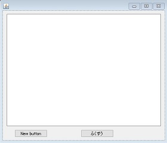
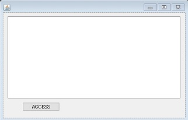

# work_JavaServlet
サーブレット用に作成した、Javaソースのサンプルです。  

# 環境
・Apache Tomcat
・Eclipse 4.2 Juno

# サンプル紹介
**JSONServerTest**  
**JSONClientSwing**  
HTTPサーバーとJSONデータをやり取りするサンプルです。  
受け取ったデータを逆シリアル化しクラス・インスタンスを生成しています。  
  
＃EclipseにTomcatを設定し、ServerTestをデプロイして下さい。  
＃クライアントはJava(Swing)で作成しています。  

**OAuthTest**  
認証を受け、Web-API経由でTwitterに呟くサンプルです。  
OAuth認証を、scribe-javaとtwitter4jを使って行っています。  
＃Apacheに登録して実行して下さい。  

**SOAPServerTest**  
**SOAPServerTest2**  
**SOAPServerTest3**  
**SoapClientSwing**  
SOAP（Simple Object Access Protocol)でサーバーにアクセスするサンプルです。  
  
＃EclipseにTomcatを設定し、ServerTestをデプロイして下さい。  
＃クライアントはJava(Swing)で作成しています。  
